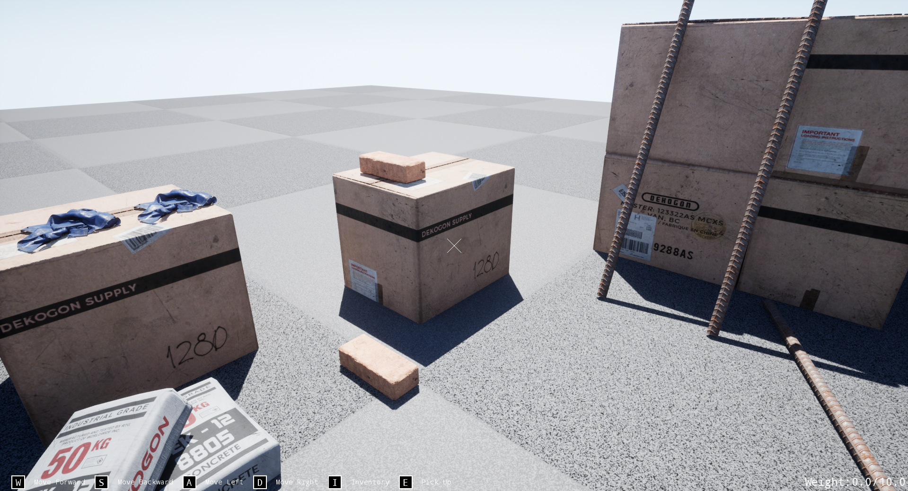
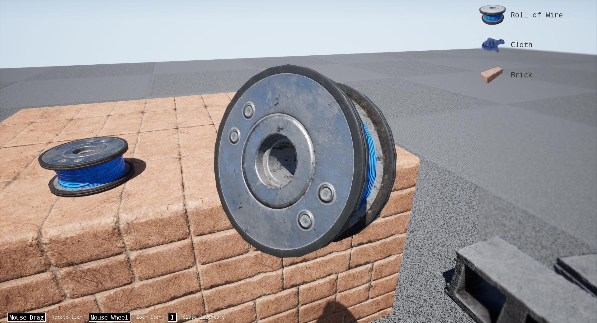


# Task 1

First person game where you can store items into the inventory and inspect them later.
The project uses Gameplay Ability System and has abilities to pick up objects and to
open/close the inventory. The pick up ability uses cost effect with custom class for
modifier magnitude calculation. Note that there's maximum weight player can carry (10.0kg by default) and 
the player can't pick up items more than that. Current and maximum weight are displayed in
the right bottom corner of the screen.

The game items are configured through corresponding
data assets.

#### Screenshot #1

#### Screenshot #2
 

Meshes, some of the textures, some materials and sound waves are of external origin.
